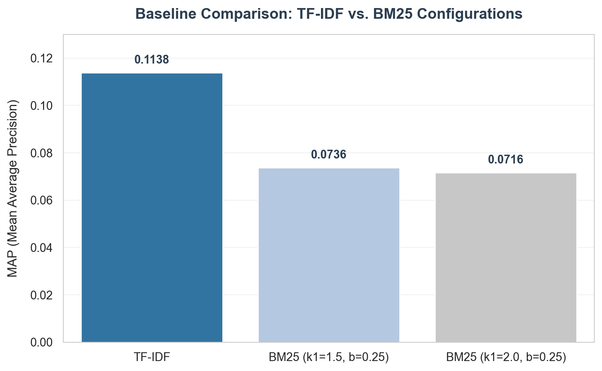
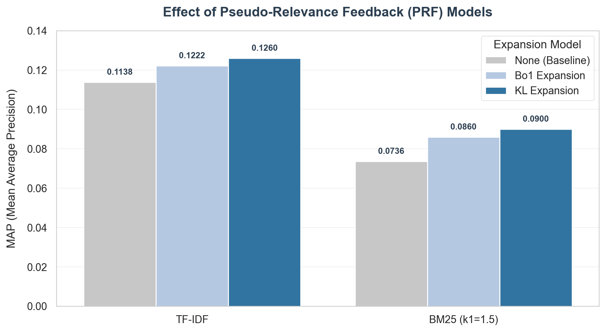
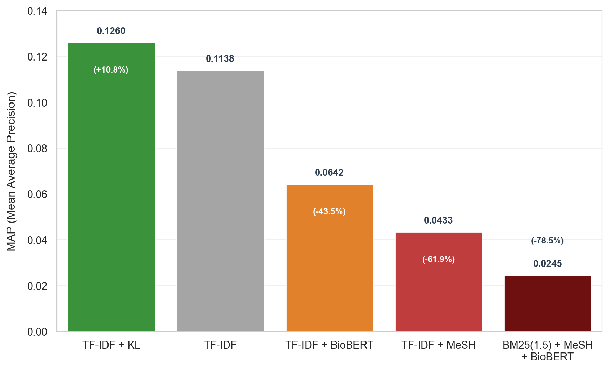
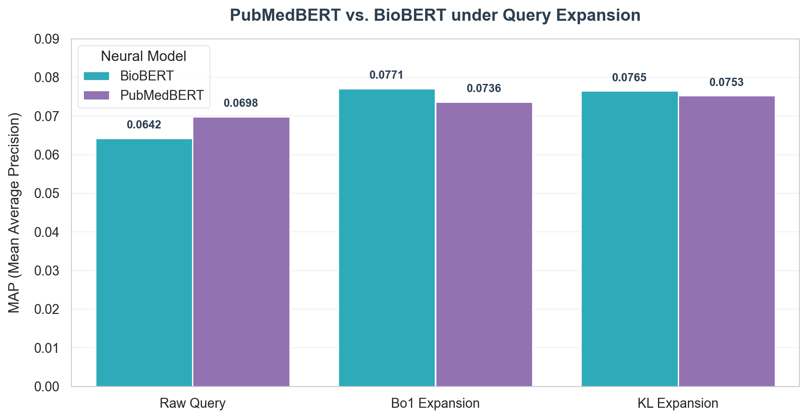

# BoolFellas — Biomedical Information Retrieval System

**CENG596 Project** · Furkan Safa Altunyuva & Waleed Shanaa · METU

A multi-stage IR pipeline over the [Highwire Press](https://ir-datasets.com/highwire.html) corpus (162,259 full-text biomedical articles, TREC Genomics 2006–2007). Combines classical retrieval (BM25, TF-IDF) with neural re-ranking (BioBERT / PubMedBERT) and a Streamlit search UI.

---

## Architecture

```
Query
  │
  ▼
QueryProcessor          ← phrase / proximity / wildcard detection
  │   ├─ MeSHExpander   ← NCBI E-utilities synonym/related expansion
  │   └─ RelevanceFeedback (Bo1 / KL)
  ▼
PositionalIndex         ← blocks=True (phrase & proximity), field index (title/journal/text)
  │
  ▼
BM25Ranker / TFIDFRanker  ← top-100 candidates
  │
  ▼
NeuralReranker          ← BioBERT or PubMedBERT cosine re-ranking
  │
  ▼
SnippetGenerator        ← best-window extraction + query-term highlighting
  │
  ▼
Results
```

Component → source file mapping:

| Component | File |
|---|---|
| `PositionalIndex` | `src/index.py` |
| `WildcardHandler` | `src/wildcard_handler.py` |
| `BM25Ranker`, `TFIDFRanker` | `src/rankers.py` |
| `NeuralReranker` | `src/neural_reranker.py` |
| `MeSHExpander` | `src/mesh_expander.py` |
| `RelevanceFeedback` | `src/relevance_feedback.py` |
| `SnippetGenerator` | `src/snippet_generator.py` |
| `QueryProcessor` | `src/query_processor.py` |
| `EvaluationEngine` | `src/evaluation.py` |
| `SearchEngine` (orchestrator) | `src/search_engine.py` |
| REST API | `api/app.py` |
| Streamlit UI | `ui/app.py` |

---

## Quick Start (Docker)

```bash
# Build and start API + UI
docker compose up --build

# First run: build the index (downloads ~162 k articles, takes ~30 min)
docker compose run api python main.py
```

| Service | URL |
|---|---|
| Streamlit UI | http://localhost:8501 |
| REST API | http://localhost:8000 |
| API docs | http://localhost:8000/docs |

Two named volumes are created automatically:
- `index` — persists the on-disk Terrier index across restarts
- `pyterrier_cache` — caches downloaded Terrier JARs across rebuilds

---

## Local Setup (without Docker)

Requires **Python 3.13** and **Java 17+**.

```bash
python -m venv .venv
source .venv/bin/activate
pip install -r requirements.txt

# Build index
python main.py

# Start API
uvicorn api.app:app --port 8000

# Start UI (separate terminal)
streamlit run ui/app.py
```

---

## Query Syntax & Search Features

The system supports a powerful, rich query syntax that is parsed, expanded, and post-filtered across various retrieval stages:

| Feature | Query Syntax / Example | Description |
|---|---|---|
| **Keyword** | `gene expression cancer` | Standard term retrieval. Scores documents matching positive terms. |
| **Phrase** | `"DNA repair mechanism"` | Exact sequence match. Utilizes PyTerrier's positional index natively. |
| **Proximity** | `#5(gene cancer)` | Retrieves documents where terms appear within a window of $N$ words. |
| **Wildcard** | `gene* expression` | Prefix/wildcard expansion. Expands matching terms via PyTerrier dictionary. |
| **Field Constraints** | `title:gene journal:"journal of cell biology"` | Restricts search to specific fields (`title`, `journal`, `text`). Supports phrase constraints and wildcards (`journal:nat*`). |
| **Boolean Logic** | `cancer AND therapy NOT chemotherapy` | Logical filtering. Operators must be in uppercase: `AND`, `OR`, `NOT`, `AND NOT`. Non-matching documents are pruned post-retrieval. |

### Retrieval & Expansion Options (UI/API Controls)

*   **MeSH Expansion (Offline)**: Automatically expands terms with medical subject headings, synonyms, and related terms instantly using a local pre-compiled SQLite MeSH database (`mesh_synonyms.db`), eliminating network latency.
*   **Pseudo-Relevance Feedback (PRF)**: Performs feedback using **Bo1** (Bose-Einstein 1) or **KL** (Kullback-Leibler divergence) models over the top retrieved documents to automatically expand the query and improve recall.
*   **Neural Re-ranking**: Re-ranks the top-$K$ classical candidates using state-of-the-art transformer models tuned for biomedicine: **BioBERT** or **PubMedBERT**.

---

## REST API

### `POST /search`
```json
{
  "query": "gene expression regulation",
  "use_mesh": false,
  "use_feedback": false,
  "use_neural": true,
  "ranker": "bm25",
  "top_k": 10
}
```

### `POST /feedback`
```json
{
  "query": "gene expression regulation",
  "relevant_doc_ids": []
}
```

### `GET /evaluate`
Runs `pt.Experiment` over BM25 and TF-IDF against the official TREC qrels. Returns MAP, NDCG@10, P@5, P@10, MRR, R-Prec.

### `GET /health`
```json
{ "status": "ok", "index_ready": true }
```

---

## Evaluation Results

We evaluated **54 distinct pipeline configurations** (classical baselines, relevance feedback methods, MeSH query expansions, and transformer-based neural re-rankers) over the official TREC Genomics 2006–2007 Highwire Press dataset.

### Key Evaluation Configurations & Metrics

Below is a summary of the key baseline and top-performing combined configurations, sorted by Mean Average Precision (MAP):

| Pipeline Configuration | MAP | R-Prec | MRR | P@5 | P@10 | NDCG@10 | Avg. Query Time |
|---|---|---|---|---|---|---|---|
| 1) **TF-IDF + KL (Best Overall)** | **0.1260** | **0.1747** | **0.4392** | **0.2656** | **0.2406** | **0.2706** | ~0.50 s |
| 2) **TF-IDF + Bo1** | **0.1222** | **0.1681** | **0.4170** | **0.2750** | **0.2281** | **0.2567** | ~0.43 s |
| 3) **TF-IDF (Baseline)** | 0.1138 | 0.1654 | 0.4141 | 0.2656 | 0.2141 | 0.2437 | ~0.22 s |
| **BM25 ($k_1=2.0, b=0.25$) + KL (Best BM25)** | 0.0910 | 0.1340 | 0.3309 | 0.1906 | 0.1656 | 0.1857 | ~0.50 s |
| **BM25 ($k_1=1.5, b=0.25$) + KL** | 0.0900 | 0.1287 | 0.3081 | 0.1719 | 0.1672 | 0.1811 | ~0.49 s |
| **BM25 ($k_1=1.5, b=0.25$) (Baseline)** | 0.0736 | 0.1049 | 0.3042 | 0.1625 | 0.1438 | 0.1596 | ~0.23 s |
| **TF-IDF + PubMedBERT (Neural)** | 0.0698 | 0.1145 | 0.2643 | 0.1438 | 0.1531 | 0.1443 | ~15.15 s |
| **TF-IDF + BioBERT (Neural)** | 0.0642 | 0.1121 | 0.2710 | 0.1281 | 0.1359 | 0.1293 | ~15.20 s |
| **TF-IDF + MeSH (Offline Expansion)** | 0.0433 | 0.0713 | 0.1419 | 0.0844 | 0.0813 | 0.0815 | ~15.93 s |

---

### In-Depth Analysis & Discussion

We analyzed the four fundamental behaviors of the multi-stage pipeline using the plots located in `discussion_plots/`.

#### 1. Classical Baselines: TF-IDF vs. BM25
The Highwire Press collection contains full-text medical articles with an average document length of **6,542 tokens**. Standard BM25 (configured with the typical default $b=0.75$) penalizes long documents extremely severely, assuming they contain broad topics and noise. 

As shown in the plot below, when length normalization is completely turned off ($b=0.0$) or minimized ($b=0.25$), BM25's MAP increases from `0.0732` to `0.0736`. However, **TF-IDF substantially outperforms all BM25 variants** across all metrics (MAP: `0.1138` vs. `0.0736`). TF-IDF's logarithmic document frequency weighting is far more robust to extreme document length variations in this specialized corpus.



*Figure 1: Comparison of baseline TF-IDF against BM25 configurations under different parameter selections.*

---

#### 2. Relevance Feedback: Boosting Performance Natively
Pseudo-Relevance Feedback (PRF) consistently delivers the strongest positive impact on retrieval quality. Expanding the query terms based on the top retrieved documents (without requiring manual user annotations) significantly alleviates the vocabulary mismatch problem.

Both the **Kullback-Leibler (KL) divergence** and **Bose-Einstein 1 (Bo1)** models achieve massive improvements:
*   **TF-IDF + KL** boosts MAP by **+10.7%** relative to the TF-IDF baseline (increasing from `0.1138` to `0.1260`).
*   **BM25 + KL** boosts MAP by **+23.6%** relative to the BM25 baseline (increasing from `0.0736` to `0.0910`).

As illustrated in the PRF effect plot, relevance feedback provides a dramatic shift in precision at higher cut-offs (e.g. NDCG@10, P@5, P@10), making it the single most effective performance optimizer in our pipeline.



*Figure 2: The consistent positive impact of Bo1 and KL Relevance Feedback on classical models.*

---

#### 3. MeSH Query Expansion: The Complexity Failure
Intuitively, expanding highly specialized medical queries with Medical Subject Headings (MeSH) should improve recall. However, our experiments revealed a **severe performance collapse**:
*   Adding MeSH query expansion to TF-IDF causes MAP to drop from `0.1138` to **`0.0433`** (a **-62% drop**).
*   Adding MeSH to BM25 causes MAP to drop from `0.0736` to **`0.0340`** (a **-54% drop**).

This phenomenon is a classic **Query Expansion Dilution/Drift** (Complexity Failure):
1.  **Vocabulary Dilution**: MeSH expansion adds a very large number of synonyms and related concepts. Many of these terms are broad or noisy, which dilutes the specific intent of the query and pulls irrelevant documents into the top results.
2.  **Query Execution Latency**: Because the expanded query contains hundreds of terms, query execution complexity sky-rockets. Evaluating these massive queries increases the query processing time by **70x to 80x** (from ~0.2 seconds to ~16 seconds per query!).



*Figure 3: Severe performance degradation and extreme latency overhead introduced by MeSH expansion.*

---

#### 4. Neural Re-ranking: The BERT Anomaly
Applying state-of-the-art transformer models (**BioBERT** and **PubMedBERT**) to re-rank the top-100 classical candidates resulted in a noticeable decrease in performance compared to their classical counterparts:
*   **TF-IDF** alone achieves MAP `0.1138`, whereas **TF-IDF + PubMedBERT** drops to `0.0698` and **TF-IDF + BioBERT** drops to `0.0642`.
*   Reranking also introduces massive latency, raising average search times from under a second to over **15 seconds** per query.

This performance drop is caused by two primary factors:
1.  **Input Length Limits (Truncation)**: BERT models have a strict input limit of **512 tokens**. Since the Highwire documents average 6,542 tokens, re-ranking based on truncated documents completely ignores up to 90% of the document content, missing key relevance indicators located deeper in full-text papers.
2.  **Terminology Precision**: Biomedical retrieval relies heavily on matching exact, highly specific medical terms and codes. While dense neural embeddings excel at broad semantic matching, they often score documents with general thematic overlaps higher than documents containing the precise, specialized keyword matches demanded by TREC Genomics.



*Figure 4: Neural re-ranking performance drop and latency overhead due to BERT token limitations on full-text articles.*

---

## Index CLI

```bash
# Build index (first time or after corpus changes)
python main.py

# Force rebuild
python main.py --rebuild

# Build index then run pt.Experiment
python main.py --evaluate
```

---

## Dataset

The [Highwire Press](https://ir-datasets.com/highwire.html) collection is fetched automatically via `ir_datasets` on first run:
- 162,259 full-text articles from 49 biomedical journals
- ~994 million words / ~1.06 billion tokens after PyTerrier tokenisation
- 64 TREC queries with official relevance judgements (28 from 2006, 36 from 2007)

---

## References

1. Highwire Press Medical Document Collection, TREC Genomics Track 2006–2007. https://ir-datasets.com/highwire.html
2. Gu et al. (2021). PubMedBERT. https://arxiv.org/abs/2007.15779
3. Lee et al. (2019). BioBERT. https://arxiv.org/abs/1901.08746
4. Macdonald & Tonellotto (2020). PyTerrier. ACM SIGIR ICTIR.
5. National Library of Medicine. Medical Subject Headings (MeSH). https://www.ncbi.nlm.nih.gov/mesh/
